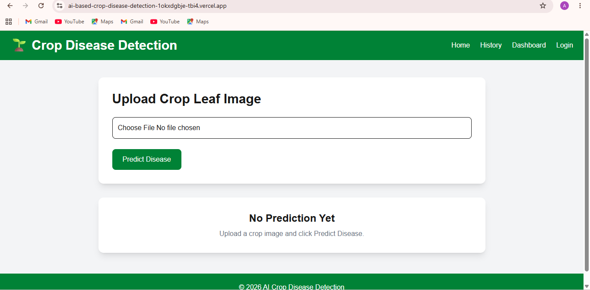
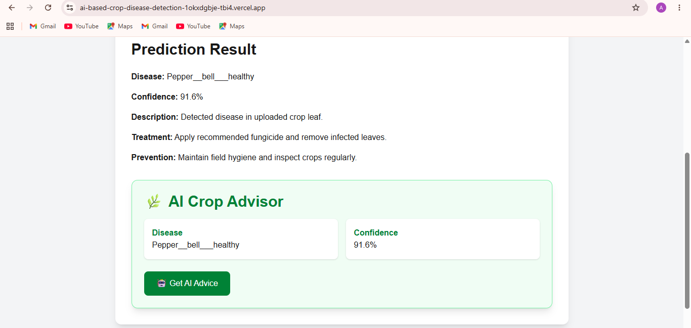
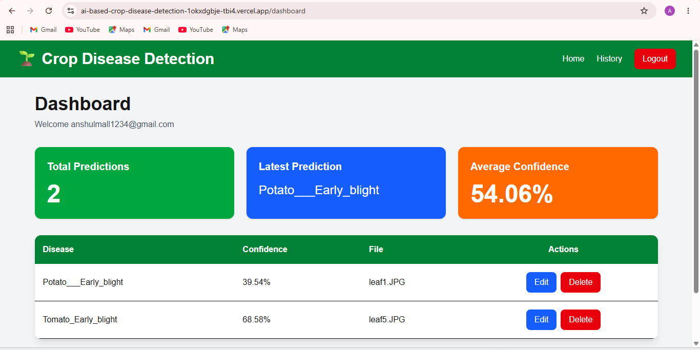

# 🌱 AI-Based Crop Disease Detection System

An AI-powered full-stack web application that helps farmers identify crop diseases by uploading plant leaf images.

The system uses a **Deep Learning image classification model with ONNX Runtime** for disease prediction, provides confidence scores, stores prediction history, and uses **Google Gemini AI** to generate disease explanations, treatment recommendations, and prevention methods.

This project combines **Artificial Intelligence, Machine Learning, Full Stack Development, and Cloud Deployment** to provide a smart farming assistance solution.

---

# 🚀 Live Demo

## 🌐 Frontend Application (Vercel)

https://ai-based-crop-disease-detection-drab.vercel.app/


## ⚙️ Backend API (Render)

https://ai-based-crop-disease-detection-3.onrender.com/


## 📖 API Documentation (Swagger)

https://ai-based-crop-disease-detection-3.onrender.com/docs

---

# 🎯 Project Objective

The objective of this project is to develop an AI-based crop disease detection system that helps users identify plant diseases at an early stage using leaf image analysis.

The system aims to:

- Reduce manual disease identification efforts
- Provide quick disease prediction using Deep Learning
- Generate AI-based treatment and prevention guidance
- Maintain user prediction history for better monitoring

---


# 🔑 Demo Account

---
Use the following credentials to test the application:

**Email:** anshulsingh1234@gmail.com
**Password:** anshulsingh1234

---


# 📸 Application Screenshots


## 🔐 Login Page




## 🌿 Disease Prediction




## 📊 Dashboard




---

# ✨ Key Features


## 🌿 AI Crop Disease Detection

- Upload plant leaf images
- Detect crop diseases using Deep Learning
- ONNX Runtime based model inference
- Display predicted disease name
- Display prediction confidence percentage
- Support image-based crop disease analysis

---

## Important Usage Note

To use the crop disease prediction feature correctly, please follow this flow:

1. First, create an account and **Login**.
2. After successful login, upload the crop/plant image.
3. Click on **Predict Disease** to get the prediction result.
4. The prediction history and disease details will then be saved and displayed on your dashboard.

⚠️ Please login before making predictions. If you predict a disease without logging in and then login later, that prediction may not appear on the dashboard because it is not linked with your user account.

---


## 🤖 AI Crop Advisor

Integrated with Google Gemini AI to provide:

- Disease explanation
- Possible causes
- Treatment recommendations
- Prevention methods
- Farmer-friendly guidance

The Deep Learning model identifies the crop disease, and Gemini AI generates human-readable explanations, treatment suggestions, and prevention methods based on the prediction.

---

## 🔐 Secure Authentication

- User registration
- User login
- JWT based authentication
- Protected API routes
- Secure token authorization


---

## 📊 User Dashboard

Dashboard provides:

- Total prediction count
- Average confidence score
- Recent predictions
- Prediction management


---

## 📜 Prediction History Management

Users can:

- View previous predictions
- View prediction details
- Update records
- Delete prediction history


---

## 🌍 Multi Language Support

- English language support
- Hindi language support
- Responsive user interface
- Mobile-friendly design


---

# 📚 Dataset


The Deep Learning model is trained on plant leaf image datasets containing multiple crop disease categories.

The dataset contains images of different crops and their corresponding disease classes. The model learns visual patterns such as leaf spots, discoloration, and disease symptoms to classify crop diseases.

The dataset may contain different numbers of images for different crop classes, which can affect model performance across categories.


---


# 🛠 Technology Stack


## Frontend

- Next.js
- React.js
- JavaScript
- HTML5
- CSS3
- Tailwind CSS
- Axios


## Backend

- Python
- FastAPI
- Uvicorn
- Pydantic
- JWT Authentication


## Machine Learning / AI

- Deep Learning Based Image Classification
- ONNX Runtime
- OpenCV
- NumPy
- Google Gemini AI


## Database

- MongoDB Atlas


## Deployment

- Vercel (Frontend)
- Render (Backend)
- MongoDB Atlas (Database)

---

# 🏗 System Architecture


```
                 User
                  |
                  |
                  V

          Next.js Frontend
              (Vercel)

                  |
                  |
             Axios API

                  |
                  |

          FastAPI Backend
              (Render)

          /             \

         /               \

 ONNX Deep Learning     MongoDB Atlas
     Model              Database

         |
         |

   Google Gemini AI

         |
         |

 Disease Explanation
 Treatment & Prevention
 Recommendations

```

---

# 🔄 Model Workflow

1. User uploads a crop leaf image.
2. Image is processed and prepared for model inference.
3. ONNX Runtime loads the Deep Learning classification model.
4. The model predicts the crop disease class with confidence score.
5. Prediction result is stored in MongoDB.
6. Google Gemini AI generates disease explanation, treatment, and prevention recommendations.

---


# 📁 Project Structure


```
AI-Based-Crop-Disease-Detection

│
├── backend
│
│   ├── database
│   ├── middleware
│   ├── models
│   ├── routes
│   ├── schemas
│   ├── services
│   │
│   ├── ml
│   │   ├── model.onnx
│   │   ├── model.onnx.data
│   │   ├── classes.json
│   │   └── predictor.py
│   │
│   ├── app.py
│   └── requirements.txt
│
│
├── frontend
│
│   ├── app
│   ├── components
│   ├── lib
│   ├── public
│   ├── package.json
│   └── next.config.ts
│
│
├── screenshots
│
│   ├── login.png
│   ├── prediction.png
│   └── dashboard.png
│
│
├── README.md
└── .gitignore

```

---

# ⚙️ Installation & Setup


## Clone Repository


```bash
git clone https://github.com/anshulmall06/AI-Based-Crop-Disease-Detection.git
```


Navigate into project:


```bash
cd AI-Based-Crop-Disease-Detection
```


---

# Backend Setup


Go to backend folder:


```bash
cd backend
```


Create virtual environment:


```bash
python -m venv venv
```


Activate environment:


### Windows

```bash
venv\Scripts\activate
```


Install dependencies:


```bash
pip install -r requirements.txt
```


Run backend:


```bash
uvicorn app:app --reload
```


Backend will run on:


```
http://127.0.0.1:8000
```


---

# Frontend Setup


Open another terminal:


```bash
cd frontend
```


Install dependencies:


```bash
npm install
```


Start application:


```bash
npm run dev
```


Frontend will run on:


```
http://localhost:3000
```

---

# 🔑 Environment Variables


Create `.env` file inside backend folder:


```env
MONGO_URI=your_mongodb_connection_string

JWT_SECRET_KEY=your_secret_key

GEMINI_API_KEY=your_google_gemini_api_key

```


---

# 🔌 API Endpoints


## Authentication


| Method | Endpoint | Description |
|---|---|---|
| POST | `/auth/register` | Create new user |
| POST | `/auth/login` | User login |


---

## Disease Prediction


| Method | Endpoint | Description |
|---|---|---|
| POST | `/predict` | Predict crop disease |


---

## AI Advisor


| Method | Endpoint | Description |
|---|---|---|
| POST | `/ai/explain` | Generate AI recommendations |


---

## Prediction History


| Method | Endpoint | Description |
|---|---|---|
| GET | `/predictions` | Get all predictions |
| GET | `/predictions/{id}` | Get prediction details |
| PUT | `/predictions/{id}` | Update prediction |
| DELETE | `/predictions/{id}` | Delete prediction |


---

# 🔐 Authentication Flow


1. User registers an account
2. User logs in
3. Backend generates JWT token
4. Token is stored on client side
5. Protected APIs require:

```
Authorization: Bearer <JWT_TOKEN>
```

---

# 🌐 Deployment


## Frontend

Platform:

```
Vercel
```

Framework:

```
Next.js + React
```


URL:

```
https://ai-based-crop-disease-detection-drab.vercel.app/
```


---

## Backend


Platform:

```
Render
```


Framework:

```
FastAPI + Python
```


URL:

```
https://ai-based-crop-disease-detection-3.onrender.com/
```


---

## Database


Platform:

```
MongoDB Atlas
```


---

# ⚠️ Limitations


- The model performance depends on the quality, diversity, and balance of the training dataset. Classes with more training samples may achieve better recognition compared to classes with fewer samples.

- Predictions may vary for images with poor lighting, complex backgrounds, unclear leaf patterns, or images from unseen crop varieties.

- The current model supports only the crop and disease classes included in the training dataset. It may not accurately identify diseases from unsupported crops.

- Future improvements include expanding the dataset, applying class balancing techniques, adding more crop categories, and improving model accuracy through advanced training strategies.


---

# 🚀 Future Enhancements


- Mobile application
- Real-time camera disease detection
- More crop categories
- Cloud image storage
- Weather-based disease prediction
- Smart farming analytics
- Disease alert notification system


---

# 👨‍💻 Developer


**Anshul**

MCA Student  
Graphic Era University


GitHub:

https://github.com/anshulmall06


---

# 📄 License


This project is developed for educational and internship purposes.

---

# 🙏 Acknowledgements


- FastAPI
- Next.js
- MongoDB Atlas
- Google Gemini AI
- ONNX Runtime
- OpenCV
- Vercel
- Render
- Axios
